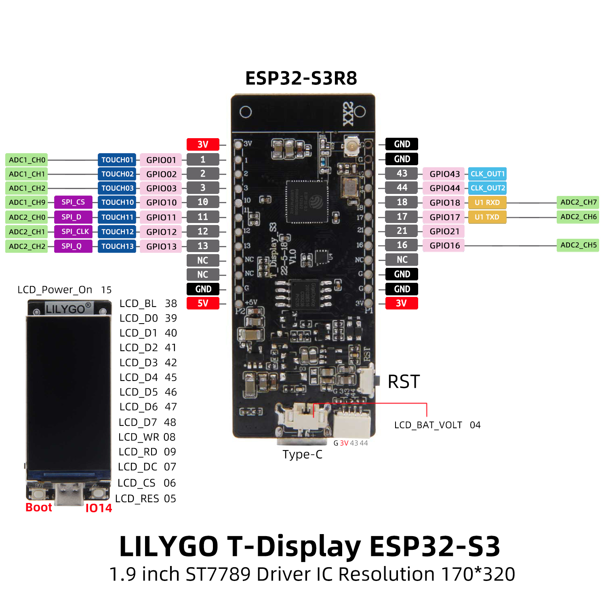
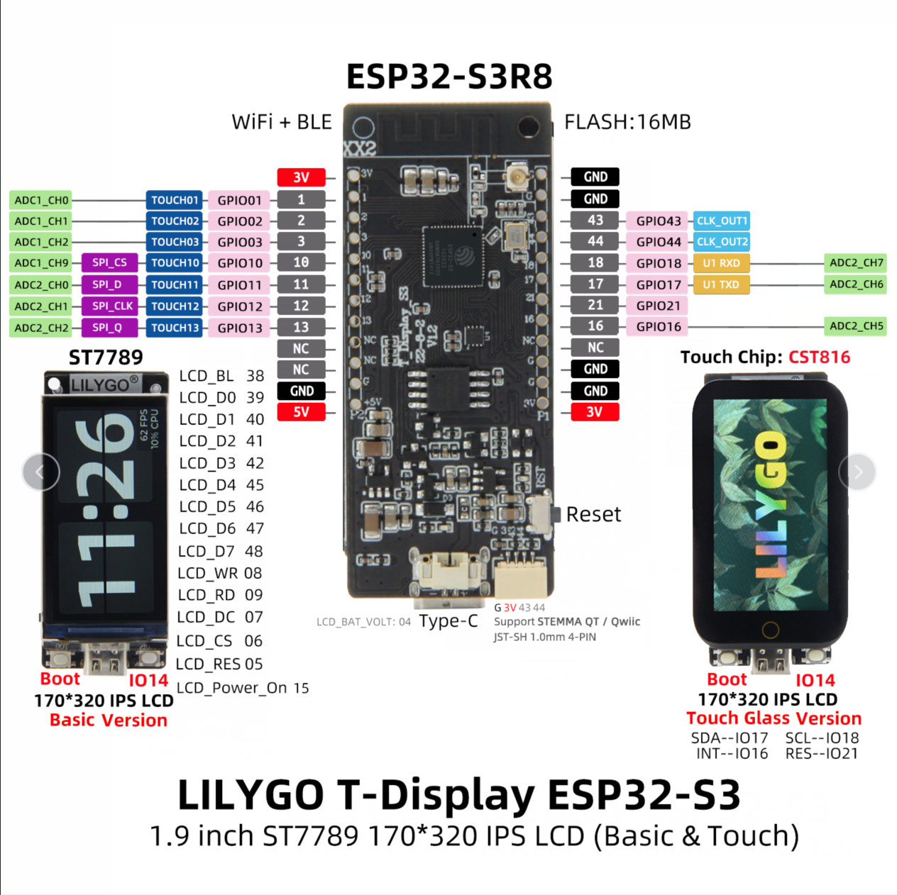
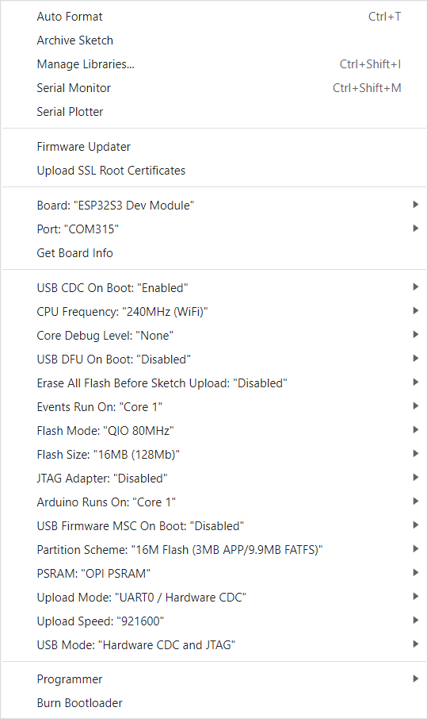

<h1 align = "center"> 🌟T-Display-S3🌟</h1>

## Description

T-Display-S3 is a ESP32-S3 development board. It is equipped with a color 1.9" LCD screen and two programmable buttons. Communication using I8080 interface. Retains the same layout design as T-Display. You can directly use ESP32S3 for USB communication or programming.

## T-Display-S3 Pinout

## T-Display-S3 TOUCH Pinout

## Where to buy

T-Display-S3 is available from: [LILYGO](https://www.lilygo.cc/products/t-display-s3), [Amazon](https://www.amazon.com/dp/B0B7X5RVTH?ref=myi_title_dp) and [Aliexpress](https://www.aliexpress.com/item/3256804310228562.html).

## Quick Start

### Arduino

**Please use Arduino ESP32 version below 3.0. There are too many changes in version 3.0 and it has not been updated yet.**

1. In Arduino Preferences, on the Settings tab, enter the `https://raw.githubusercontent.com/espressif/arduino-esp32/gh-pages/package_esp32_index.json` URL in the `Additional boards manager URLs` input box. 
2. Click OK and the software will install. 
3. Search for ESP32 in Tools → Board Manager and install `esp32` (Arduino-ESP32)
4. Copy everything from this repository lib folder to [Arduino library folder](https://docs.arduino.cc/software/ide-v1/tutorials/installing-libraries#manual-installation) (e.g. `C:\Users\YourName\Documents\Arduino\libraries`)
5. Select the correct settings in the Tools menu as shown below.
   

#### Writing as a beginner

- When opening the Arduino IDE, you will be prompted that there are new libraries that can be updated. Please do not click update. There is no guarantee that it can be compiled, run, etc. after the update. Make sure that the board is running normally before deciding whether to update. You have to Know that problems may occur after updating due to library differences, or the default configuration (such as TFT_eSPI) will be overwritten.
- If it runs abnormally after the update, please follow Article 4 of the Arduino Quick Start to delete the directory in libraries, and drag the folder in lib into the libraries directory again.

### PlatformIO

1. Install [VisualStudioCode](https://code.visualstudio.com/) and [Python](https://www.python.org/)
2. Search for the `PlatformIO` plugin in the `VisualStudioCode` extension and install it.
3. After the installation is complete, you need to restart `VisualStudioCode`
4. After restarting `VisualStudioCode`, select `File` in the upper left corner of `VisualStudioCode` -> `Open Folder` -> select the `T-Display-S3` directory
5. Click on the `platformio.ini` file, and in the `platformio` column, cancel the sample line that needs to be used, please make sure that only one line is valid
6. Click the (✔) symbol in the lower left corner to compile
7. Connect the board to the computer USB
8. Click (→) to upload firmware
9. Click (plug symbol) to monitor serial output

### ESP-IDF

The installation method varies depending on the system, refer to the [official manual](https://docs.espressif.com/projects/esp-idf/en/latest/esp32/get-started/index.html) for installation.

- Using IDF version 4.4

### Micropython

- [russhughes/st7789s3_mpy](https://github.com/russhughes/st7789s3_mpy)
- [Micropython](https://github.com/Xinyuan-LilyGO/lilygo-micropython)

## FAQ

1. The program can be written normally, but there is still no display after writing
   1. There are factory test files in the firmware folder, which can be flashed into the board to check whether the board is normal. If there is still no display, then it can be judged that there is a problem with the board or the screen
   2. Delete the <TFT_eSPI> in the libraries, and replace the <TFT_eSPI> in the <lib> folder of the main page to the libraries directory
   3. When opening the Arduino IDE, it prompts whether to upgrade the library, please choose not to upgrade, otherwise it will overwrite the configuration of the <TFT_eSPI> display

2. The board uses USB as the JTAG upload port. When printing serial port information on USB_CDC_ON_BOOT configuration needs to be turned on. 
If the port cannot be found when uploading the program or the USB has been used for other functions, the port does not appear. 
Please enter the upload mode manually. 
   1. Connect the board via the USB cable
   2. Press and hold the BOOT button , While still pressing the BOOT button, press RST
   3. Release the RST
   4. Release the BOOT button
   5. Upload sketch

3. If the above is invalid, burn the [binary file](./firmware/README.MD)  to check whether the hardware is normal
   - [Video](https://youtu.be/L-W3dCMtEdo)