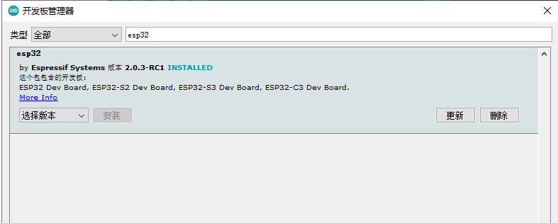

<h1 align = "center"> 🌟T-Display-S3🌟</h1>

## Description

T-Display-S3 is a development board whose main control chip is ESP32-S3. It is equipped with a 1.9-inch LCD color screen and two programmable buttons.Communication using I8080 interface Retains the same layout design as T-Display. You can directly use ESP32S3 for USB communication or programming.

## Pinmap

## Product 📷

|  Product |  Product Link |
| :--------: | :---------: |
| T-Display-S3 |  [Website](https://www.lilygo.cc/products/t-display-s3)   |
| T-Display-S3 |  [Amazon](https://www.amazon.com/dp/B0B7X5RVTH?ref=myi_title_dp)   |
| T-Display-S3 |  [Aliexpress](https://www.aliexpress.com/item/3256804310228562.html)   |

## Quick Start

### Notice
> The board uses USB as the JTAG upload port. When printing serial port information on USB, CDC_ON_BOOT configuration needs to be turned on. 
> If the port cannot be found when uploading the program or the USB has been used for other functions, the port does not appear. 
> Please enter the upload mode manually. 
>-  Press and hold the BOOT button when the power is off, the button is located behind the RST button.
>-  When the USB is connected, first press and hold the BOOT button, then click reset and then release the BOOT button

> Arduino:
>- Click "File" in the upper left corner -> Preferences -> Additional Development >Board Manager URL -> Enter the URL in the input box.
(ESP32S3 is a new chip, and the SDK version needs to be version 2.0.3 or above)
> `https://raw.githubusercontent.com/espressif/arduino-esp32/gh-pages/package_esp32_index.json`
>-  Click OK and the software will be installed by itself. After installation, restart the Arduino IDE software.
>- Search for ESP32 in Tools->Board Manager and install ESP32-Arduino SDK

>- Copy all files in the lib folder to `C:\Users\YourName\Documents\Arduino\libraries`
>- Select the settings as shown. Note that the FLASH size partition and size may be modified depending on the board.

> PlatfromIO:
> - PlatformIO plug-in installation: Click on the extension on the left column -> search platformIO -> install the first plug-in
> - Click Platforms -> Embedded -> search Espressif 32 in the input box -> select the corresponding firmware installation

> ESP-IDF:
> - The installation method is also inconsistent depending on the system, it is recommended to refer to the [official manual](https://docs.espressif.com/projects/esp-idf/en/latest/esp32/get-started/index.html) for installation

## Quick question and answer

1. The TFT_eSPI library used does not display properly?
> The TFT_eSPI library needs to modify some settings. It has been modified in the lib. Please use this library or add Micky_commit.patch to the local library. 
> Drag and drop all files in the lib directory directly into the [`C:\Users\YourName\Documents\Arduino\libraries`] directory

## Tips

1. Use board as delivered. Connect board to usb to computer without
touching anything else. Upload the code. The code will start right after
download and run. Unplug the board and connect to usb again. The board
will not do anything.

2. Use board as delivered. Push down boot button. While boot button is
pushed, connect usb to computer. Release boot button. Upload the code.
The code will not start right after download. Nothing will happen.
Unplug the board and connect to usb again.The board will now boot the
code. Unplug the board from USB to computer and connect to other power
source like LiPO battery. Again the board will start the code. The
computer is not needed again.

New code can be loaded to the board by going to step 1 or 2. Both will
still work.
