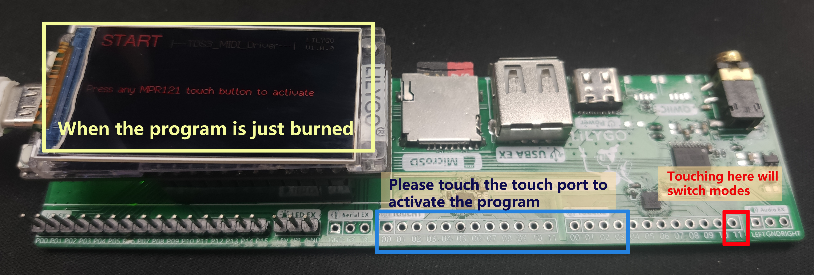
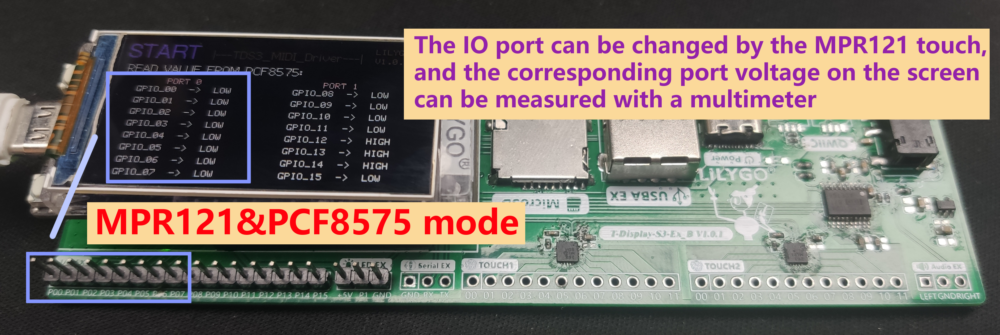
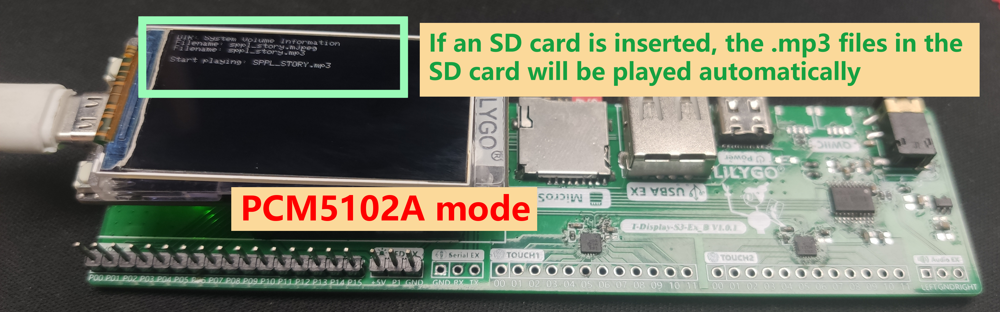
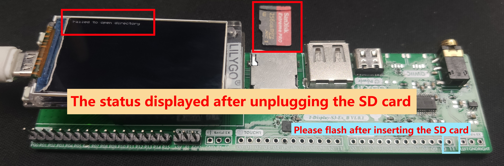
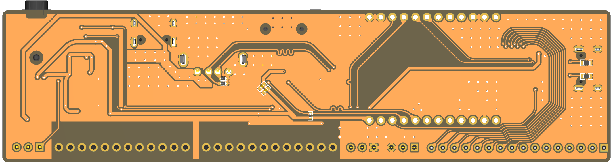
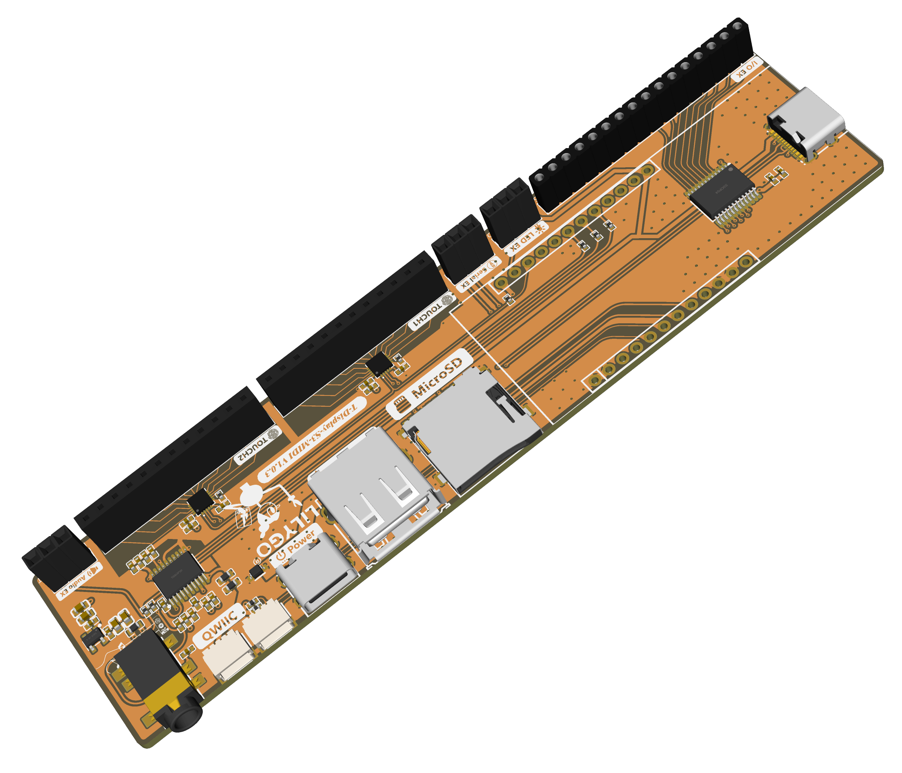
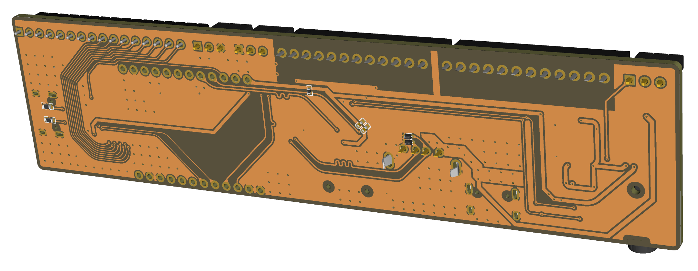

<!--
 * @Description:T-Display-S3-MIDI Test instructions
 * @version: V1.0.0
 * @Author: LILYGO_L
 * @Date: 2023-07-10 11:24:19
 * @LastEditors: LILYGO_L
 * @LastEditTime: 2023-07-13 19:23:28
 * @License: GPL 3.0
-->
# T-Display-S3-MIDI Test instructions

### TEST:
* When the program is freshly burned, you can see the "START" text in red. By touching any of the TOUCH0 (0-11) or TOUCH1 (0-10) pins of the MPR121 touch sensor, the system is activated. At this point, the "START" text changes to purple, indicating that the PCF8575 and MPR121 modes are being tested. Next, when you touch the touch IO pins, you can observe that the GPIO level of PCF8575 on the screen flips (one flip per touch). The touch range includes TOUCH0 (0-11) and TOUCH1 (0-3). If this occurs, it indicates a successful test of PCF8575 and MPR121; otherwise, it fails.
* When touching the 11th pin of TOUCH1, the system can be switched to test PCM5102A mode. If an SD card is present, it will scan all files inside and display them on the T-Display-S3 screen. It will then proceed to play the ".mp3" file. Otherwise, the screen will display "Failed to open directory" (requiring a mode switch to attempt playback again). Any other situation will be considered a test failure.

## 1. Programming test picture

## 2. MPR121&PCF8575 test picture

## 3. PCM5102A test picture

## 4. The SD card fails test picture

## 5. PCB Rendering 1 picture

## 6. PCB Rendering 2 picture

## 7. PCB Rendering 3 picture

## 8. PCB Rendering 4 picture

