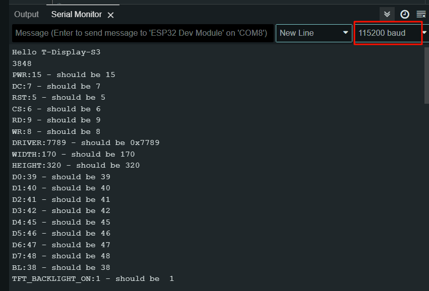

# T-Display-S3 Firmware

[中文版本](./README_CN.MD)

This directory contains factory firmware and testing tools for T-Display-S3 development boards, used to quickly verify hardware functionality.

## Firmware List

### T-Display-S3

| Firmware | Description | Download |
| --- | --- | --- |
| ScreenDetection | Screen detection tool | [t-display-s3-screen-detect-20230315_0x0.bin](./t-display-s3-screen-detect-20230315_0x0.bin) |
| Factory Firmware (No Touch) | Factory firmware for non-touch version | [t-display-s3-no-touch-20231013_0x0.bin](./t-display-s3-no-touch-20231013_0x0.bin) |
| Factory Firmware (Touch) | Factory firmware for touch version | [t-display-s3-touch-20230417_0x0.bin](./t-display-s3-touch-20230417_0x0.bin) |
| LVGL Demo | LVGL graphical demo | [t-display-s3-lvgl-demo-20250109_0x0.bin](./t-display-s3-lvgl-demo-20250109_0x0.bin) |
| TFT_eSPI Demo | TFT_eSPI library demo | [t-display-s3-tft-espi-20231113_0x0.bin](./t-display-s3-tft-espi-20231113_0x0.bin) |

### T-Display-S3-MIDI

| Firmware | Description | Download |
| --- | --- | --- |
| MIDI Firmware v1.0.1 | Fixed left and right channel error issue | [t-display-s3-midi-v1.0.1-20231013_0x0.bin](./t-display-s3-midi-v1.0.1-20231013_0x0.bin) |
| MIDI Firmware v1.0.0 | Original version | [t-display-s3-midi-v1.0.0-20231013_0x0.bin](./t-display-s3-midi-v1.0.0-20231013_0x0.bin) |

## Quick Hardware Diagnosis

**ScreenDetection** is a screen detection tool. After flashing, check the screen status via serial monitor:

1. Flash [t-display-s3-screen-detect-20230315_0x0.bin](./t-display-s3-screen-detect-20230315_0x0.bin)
2. Open Arduino IDE or PlatformIO serial monitor
3. Press the **RST** button (on the side of the board)
4. Serial port will automatically reconnect and output screen information



> If the serial output is normal but the screen still doesn't display, the screen may be damaged.

## Flashing Firmware

### Enter Download Mode

1. Connect the board via USB
2. Press and hold the **BOOT** button
3. Press the **RST** button
4. Release the **RST** button
5. Release the **BOOT** button
6. Flash the firmware
7. Press **RST** button to exit download mode

### Method 1: LILYGO Spark (Recommended)

The easiest way - download [LILYGO Spark](https://lilygo.cc/pages/lilygo-spark) for one-click flashing.


### Method 2: ESP Flash Download Tool

Download [Flash Download Tool](https://docs.espressif.com/projects/esp-test-tools/en/latest/esp32/production_stage/tools/flash_download_tool.html)


Press **RST** button to reset after flashing.

### Method 3: Web Flasher

Online flash tool: [ESP Web Flasher](https://espressif.github.io/esptool-js/)


Press **RST** button to reset after flashing.

### Method 4: Command Line

Install esptool:

```bash
python3 -m pip install --upgrade pip
python3 -m pip install esptool
```

**ESP32 Flash Command:**

```bash
esptool --chip esp32 --baud 921600 --before default_reset --after hard_reset write_flash -z --flash_mode dio --flash_freq 80m 0x0 firmware.bin
```

**ESP32-S3 Flash Command:**

```bash
esptool --chip esp32s3 --baud 921600 --before default_reset --after hard_reset write_flash -z --flash_mode dio --flash_freq 80m 0x0 firmware.bin
```

## Related Resources

- [Espressif Official Documentation](https://docs.espressif.com/projects/esptool/)
- [LILYGO Official Website](https://www.lilygo.cc/)
